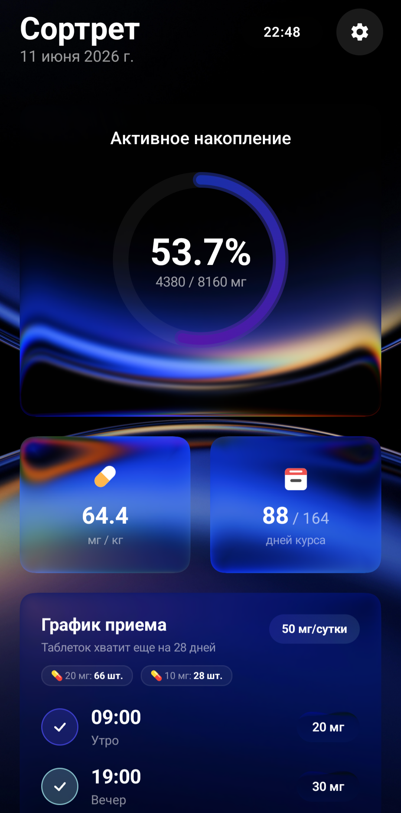
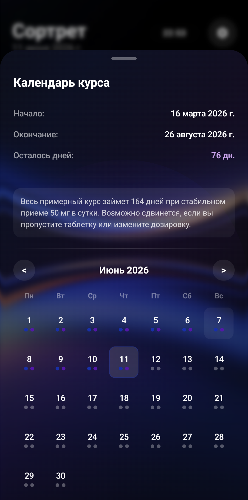
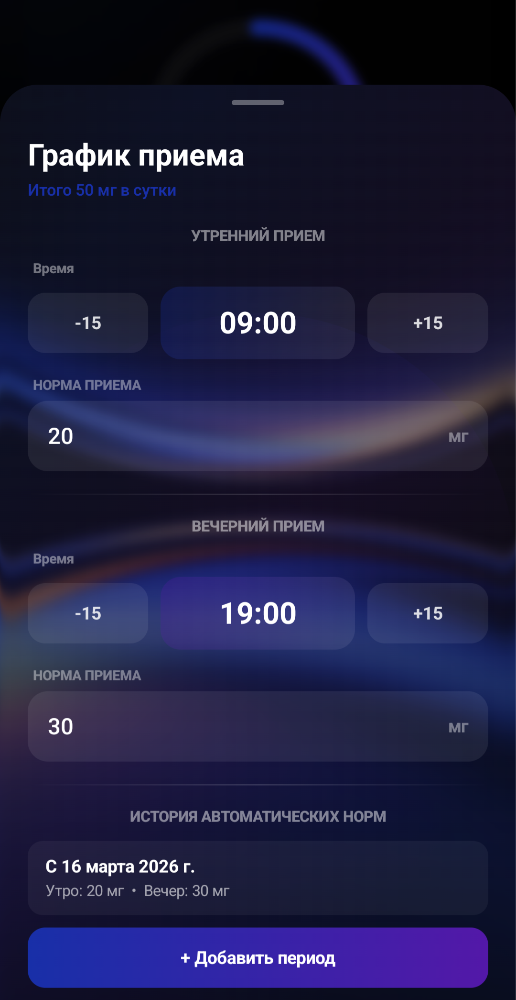

# 💊 Sortret

> **Android-приложение для отслеживания курса системных ретиноидов (Сортрет / Акнекутан / Роаккутан)** 

Приложение рассчитывает накопление кумулятивной дозы, следит за динамикой выведения вещества и радует глаз уникальным интерфейсом в стиле **Liquid Glassmorphism** (интерактивный размытый фон, преломление света, хроматическая аберрация).

  
  
  

⚠️ **Важно:** Программа не является медицинским софтом. Это удобный дневник-калькулятор. Перед началом приёма препаратов обязательно консультируйтесь с лечащим врачом-дерматологом!

---

## ⚡️ Фичи

* **📊 Умный расчёт кумулятивной дозы:** 
  Приложение автоматически считает накопленные миллиграммы и показатель **мг/кг** (соотношение к весу). Учитывается время приёмов (утро/вечер), а также смещение первого приёма (если начали вечером, утренняя доза первого дня пропускается).
* **⏳ Модель полувыведения (активное вещество):**
  Интерфейс показывает примерное количество активного вещества в организме прямо сейчас (исходя из периода полувыведения ~20 часов и экспоненциального распада).
* **💊 Инвентарь таблеток:**
  Вводите количество оставшихся таблеток по 10 и 20 мг. Приложение само списывает капсулы по мере прохождения времени приёма и прогнозирует, на сколько дней вам хватит запаса.
* **🎨 Живое жидкое стекло (Liquid Glass):**
  Полностью интерактивный размытый фон. Blobs (цветные капли) двигаются и переливаются. 
* **⚙️ Гибкая кастомизация оптики:**
  Встроен слайдерный конфигуратор «стекла»: регулируйте скругление карт (до 50 dp), высоту преломления линзы, силу смещения пикселей, контраст, размытие и хроматическую дисперсию.
* **🖼️ Кастомные обои:**
  Можно поставить любую картинку из галереи на фон. Алгоритм сам проанализирует изображение, выберет доминирующий цвет и перекрасит акцентные элементы интерфейса (кольцо прогресса, слайдеры, кнопки) под тон обоев.

---

## 🏗️ Стек технологий

* **Язык:** Kotlin + Jetpack Compose (Material 3)
* **Android:** SDK 26 (Android 8.0) — SDK 36 (Android 16)
* **Эффекты стекла:** Библиотека `io.github.kyant0:backdrop` (использование RuntimeShader на Android 13+)
* **Логика и Стор:** Kotlin Coroutines, SharedPreferences с автоматической сериализацией через Compose `snapshotFlow`.

---

## 🔬 Как считаются показатели?

* **Кумулятивная доза:**
  Приложение пробегает по календарным дням от даты старта курса до текущего времени и суммирует плановые дозы (если приём не был пропущен или скорректирован вручную).
* **Активное вещество (распад):**
  Считается по классической формуле экспоненциального распада:
  `Dose * exp(-decayConstant * hoursPassed)`
  Где `decayConstant = ln(2) / 20 часов` (период полувыведения).
* **Дата окончания курса:**
  `Оставшиеся дни = Целевая доза / Суточная доза`
  Полученное количество дней прибавляется к дате старта для прогноза окончания лечения.

---

## 🚀 Как собрать и запустить?

В корне проекта лежит готовый батник для Windows — **`build-apk.bat`**.

1. Подключите телефон к компьютеру по USB, включите «Отладку по USB».
2. Запустите **`build-apk.bat`**. 
3. Скрипт сам найдёт JDK в Android Studio, скомпилирует проект в `Sortret_v2.9.apk` и установит на телефон с **сохранением всех текущих данных**.

Также проект стандартно импортируется в Android Studio. JDK 17, Gradle 8.9.
